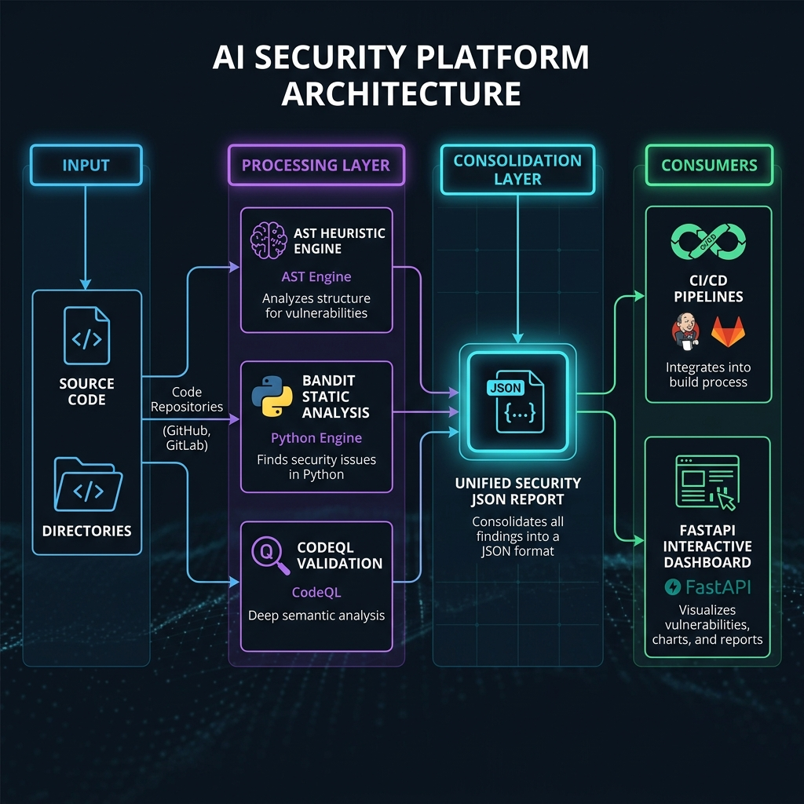

# 🛡️ Agentic AI Security Platform

[](https://www.python.org/)
[](https://fastapi.tiangolo.com)
[](https://www.docker.com/)
[](https://docs.pytest.org/)
[](LICENSE)

A professional evaluation and security audit platform designed for checking source code generated by LLM agents. Analyze code generated across multiple providers (OpenAI, Claude, Ollama) against security vulnerabilities, merge results from industry-standard scanners, and view risks via a real-time interactive dashboard.

---

## 🚀 Key Features

*   **🔍 AST-Based Heuristics**: Immediate detection of risky patterns like shell injection, dynamic execution (`eval`/`exec`), weak SSL verification, and unsafe deserialization.
*   **🔗 Deep Security Integrations**: Seamlessly wraps and merges results from **Bandit** (Python static analysis) and **CodeQL** (semantic analysis database creation).
*   **🤖 Multi-Provider AI Scanning**: Real-time status reporting and true AI-powered security auditing using **OpenAI**, **Anthropic Claude**, local **Ollama**, or **Cursor** fallbacks.
*   **📊 Interactive Web Dashboard**: A modern, single-page UI built on FastAPI to execute scans, monitor provider states, inspect vulnerability classifications, and view live metrics.
*   **💾 MLOps & CI/CD Ready**: Generates standard JSON reports for easy ingestion by downstream security operations and automation tools.

---

## 📐 Architecture Overview

The system accepts either single source files or entire code directories. It pipes files through local AST rules as well as external security scanners, compiling findings into a unified report.

<p align="center">
  
</p>

---

## 📈 Performance & Benchmarks

The platform has been optimized to evaluate code efficiency and security accuracy targets:

| Metric / Scenario | Performance Target Improvement |
| :--- | :--- |
| **Simple Coding Tasks** | `+42.0%` efficiency gain |
| **Large-scale Backend Projects** | `+24.0%` coverage/efficiency gain |

---

## 🛡️ Covered Weaknesses (MITRE CWE)

| CWE Identifier | Vulnerability Description | Default Severity | Source |
| :--- | :--- | :--- | :--- |
| **CWE-78** | Command/Shell Injection | **High** | Built-in (subprocess shell=True) |
| **CWE-94** | Dynamic Code Execution | **High** | Built-in (eval/exec usage) |
| **CWE-295** | SSL Verification Bypass | **Medium** | Built-in (requests verify=False) |
| **CWE-502** | Unsafe Deserialization | **High** | Built-in (pickle/yaml.load) |
| **CWE-77** | Command Injection (General) | **Medium** | Bandit wrapper integration |
| **CWE-79** | Cross-Site Scripting (XSS) / Semantic issues | **Medium** | CodeQL integration |

---

## 🛠️ Quick Start

### 1. Prerequisites
Ensure you have Python 3.9+ installed. The platform supports three levels of scanning:

1. **AST Heuristics (Built-in)**: Requires **zero setup**. Runs out of the box.
2. **Bandit (Python Static Analysis)**:
   * Install via pip:
     ```bash
     pip install bandit
     ```
   * The scanner will auto-detect `bandit` if it is available in your active environment path.
3. **CodeQL (Semantic Analysis)**:
   * Download the CodeQL CLI binaries for your OS from [CodeQL GitHub Releases](https://github.com/github/codeql-cli-binaries/releases).
   * Extract the contents to a folder of your choice (e.g. `/usr/local/bin/codeql` or similar).
   * Add the extracted `codeql` directory to your system's `PATH` environment variable.
   * Verify the installation by running `codeql --version` in your terminal.

### 2. Setup
Clone the repository and install the dependencies:
```bash
git clone https://github.com/skishu0413/Agentic-Security-Platform.git
cd Agentic-Security-Platform
python3 -m venv .venv
source .venv/bin/activate
pip install -r requirements.txt
```

### 3. Run Tests
Verify the installation by running the test suite:
```bash
python3 -m pytest -v
```

### 🔑 API Keys & AI Scanning Configuration

The platform supports hybrid scanning (local AST heuristics + external tools + AI model reviews). 

To configure AI-powered code reviews:
1. Copy `.env.example` to `.env`:
   ```bash
   cp .env.example .env
   ```
2. Open `.env` and fill in your API keys (e.g., `OPENAI_API_KEY`, `ANTHROPIC_API_KEY`).

> [!NOTE]
> **No API Keys? No problem!** If you do not configure any API keys (or disable them in the dashboard), the platform automatically falls back to **purely local, offline static scanning** (using built-in AST heuristics and Bandit/CodeQL if installed). It will not crash or query any external APIs.

---

## 💻 Usage

### Command Line Interface (CLI)
Analyze a file or directory and export the results to a JSON report:
```bash
# Scan a single file
python3 agentic_security_platform.py example.py --output report.json

# Scan a directory (auto-detects Bandit/CodeQL if installed)
python3 agentic_security_platform.py . --output report.json
```

### Running the Web Dashboard
Launch the FastAPI server to access the visual UI:
```bash
# Start the uvicorn development server
./start.sh
```
Once started, visit **[http://localhost:8000](http://localhost:8000)** in your browser.

---

## 🐳 Containerization & Deployment

### Local Docker Build
Build and run the platform in a containerized environment:
```bash
./deploy.sh
```

### Docker Compose
Run the API and Dashboard using Docker Compose:
```bash
docker-compose up --build
```

### Production Best Practices
When deploying to a public VPS or OpenStack instance:
1.  Run the container behind a reverse proxy like **Nginx** or **Traefik**.
2.  Enable SSL/TLS configurations.
3.  Mount a persistent volume to store generated scan reports for compliance auditing.

---

## 📁 Repository Structure

```text
├── dev_assets/                 # Source assets and brand icon templates
├── static/                     # Frontend dashboard assets
│   ├── index.html              # Main dashboard HTML interface
│   ├── dashboard.js            # Interactive scanning UI controller and API client
│   ├── style.css               # Theme and layout stylesheet
│   └── architecture_diagram.png# High-fidelity architecture visual
├── tests/                      # Pytest validation test suite
│   ├── test_agentic_security_platform.py  # Analyzer engine and rule tests
│   ├── test_api_smoke.py       # API smoke test validation
│   └── test_dashboard.py       # Dashboard API endpoint tests
├── agentic_security_platform.py# Core engine, AST parser, and folder traverser
├── app.py                      # FastAPI server runtime and controller endpoints
├── scanners.py                 # Subprocess bindings for Bandit and CodeQL
├── deploy.sh                   # Helper script for Docker image packaging
├── start.sh                    # Backend server launch script
├── Dockerfile                  # Platform container deployment definition
├── docker-compose.yml          # Container orchestration definition
├── requirements.txt            # Python dependencies configuration
├── .env.example                # Configuration template for API keys
├── SECURITY_TOOLING.md         # Strategic security tooling blueprint
├── README.md                   # Platform documentation
└── LICENSE                     # MIT License
```

---

## 📄 License
This project is licensed under the MIT License. See the [LICENSE](LICENSE) file for details.
